# Deployment Scripts

This directory contains scripts for deploying and managing the Next.js application.

## Scripts Overview

### 🚀 `deploy.sh`
Main deployment script that builds the application and prepares it for deployment.

**Features:**
- Dependency installation and verification
- Code linting and type checking
- Production build generation
- Build validation and statistics
- Optional local server for preview

**Usage:**
```bash
# Run deployment build
npm run deploy

# Run deployment build and serve locally
npm run deploy:serve
```

### 🔍 `pre-deploy-check.sh`
Comprehensive pre-deployment validation script.

**Checks:**
- Git repository status
- Uncommitted changes detection
- Dependency verification
- Linting and type checking
- Build test
- TODO/FIXME comment detection
- Console.log statement detection
- Build output validation

**Usage:**
```bash
npm run pre-deploy
```

### ✅ `verify-deployment.sh`
Post-deployment verification script that checks if the site is working correctly.

**Verifications:**
- Site accessibility
- Content verification
- Critical resource loading (CSS, JS)
- Response headers validation
- Basic performance check

**Usage:**
```bash
npm run verify-deployment
```

## NPM Scripts

### Quick Commands

```bash
# Run all pre-deployment checks
npm run pre-deploy

# Build and prepare for deployment
npm run deploy

# Build and serve locally for testing
npm run deploy:serve

# Verify deployment after going live
npm run verify-deployment

# Full deployment workflow (pre-check + build)
npm run full-deploy
```

## CI/CD Integration

### GitHub Actions Workflow
The enhanced GitHub Actions workflow (`.github/workflows/nextjs.yml`) includes:

- **Build Process:**
  - Dependency installation
  - Linting validation
  - Type checking
  - Production build
  - Build validation

- **Deployment Process:**
  - GitHub Pages deployment
  - Post-deployment verification
  - Site accessibility check
  - Deployment information summary

### Workflow Features

1. **Quality Gates:** The workflow will fail if linting or type checking fails
2. **Build Validation:** Ensures critical files exist in the build output
3. **Deployment Verification:** Checks if the deployed site is accessible
4. **Detailed Logging:** Provides comprehensive information about each step

## Usage Examples

### Local Development Workflow
```bash
# Before pushing changes
npm run pre-deploy

# If all checks pass, push to trigger deployment
git push origin main

# After deployment completes
npm run verify-deployment
```

### Local Testing
```bash
# Build and test locally
npm run deploy:serve

# This will:
# 1. Run all checks
# 2. Build the application
# 3. Start a local server on port 3000
```

### Troubleshooting Failed Deployments
```bash
# Check what went wrong locally
npm run pre-deploy

# Test build locally
npm run deploy

# Verify specific issues
npm run verify-deployment
```

## Script Configuration

### Environment Variables
- `GITHUB_PAGES=true` - Enables GitHub Pages configuration
- `NODE_ENV=production` - Sets production environment

### Customization
You can modify the scripts to:
- Add additional checks
- Change deployment targets
- Customize validation criteria
- Add notification systems

## Deployment Process Flow

```mermaid
graph TD
    A[Code Changes] --> B[Run pre-deploy checks]
    B --> C{All checks pass?}
    C -->|No| D[Fix issues]
    D --> B
    C -->|Yes| E[Push to GitHub]
    E --> F[GitHub Actions Triggered]
    F --> G[Build & Deploy]
    G --> H[Verify Deployment]
    H --> I[Site Live! 🎉]
```



## Best Practices

1. **Always run pre-deploy checks** before pushing
2. **Test builds locally** with `npm run deploy:serve`
3. **Verify deployments** after they complete
4. **Check the GitHub Actions logs** if deployment fails
5. **Keep scripts updated** as the project evolves

## Troubleshooting

### Common Issues

**Build Fails:**
- Run `npm run pre-deploy` to identify issues
- Check for TypeScript errors
- Verify all dependencies are installed

**Deployment Not Accessible:**
- Wait a few minutes for GitHub Pages to update
- Check GitHub Actions logs for errors
- Verify the repository settings for GitHub Pages

**Content Missing:**
- Check if images are properly referenced
- Verify asset paths for GitHub Pages subdirectory
- Ensure all required files are in the build output
